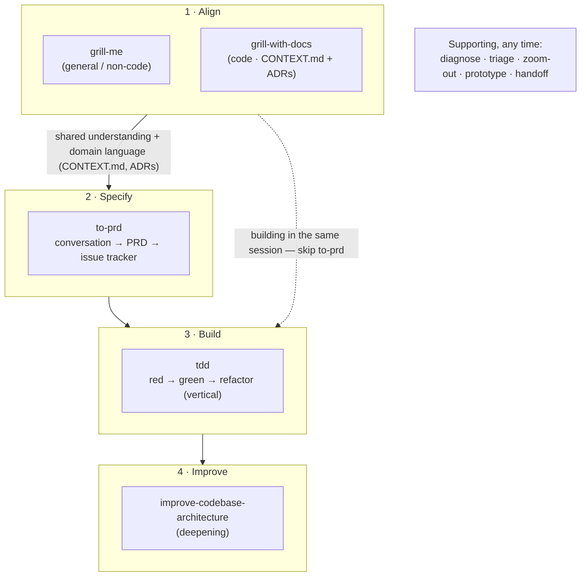

# Upstream Skill Workflow (mattpocock/skills)

This repo vendors a family of composable skills from
[mattpocock/skills](https://github.com/mattpocock/skills). They are not isolated
tools — they form a deliberate workflow with a shared philosophy. This document
records how they fit together and how to use them.

> Provenance: each vendored skill carries a `LICENSE` file recording the
> upstream URL, source path, the pinned commit SHA, and the retrieval date.
> They were brought in via [`scripts/vendor_skill.py`](../scripts/vendor_skill.py)
> (see [README → Vendoring Upstream Skills](../README.md#vendoring-upstream-skills-on-demand)),
> pinned to `mattpocock/skills @ aaf2453f`.

## Core philosophy

> **The most common failure mode in software development is _misalignment_.**

Developer and agent end up with different understandings of what is being built.
The remedy is a *grilling session* — the agent interrogates the plan before any
code is written — followed by an explicit, persisted **shared language** so that
alignment survives across sessions. The guidance from upstream is blunt:
**use the alignment skills every time you make a change.** Everything downstream
(`to-prd`, `tdd`, `improve-codebase-architecture`) builds on the understanding
and vocabulary those first skills establish.

## The workflow



## Stage-by-stage

### 1. Align — `grill-me` / `grill-with-docs`

Interview the user relentlessly about every branch of the plan, one question at
a time, resolving decisions and their dependencies before work starts. If a
question is answerable from the codebase, explore instead of asking.

| | `grill-me` | `grill-with-docs` |
|---|---|---|
| Upstream category | productivity (general, **incl. non-code**) | engineering (**code / domain**) |
| Persists anything? | No — ephemeral, feed straight into the next action | Yes — `CONTEXT.md` (glossary) + ADRs, updated inline |
| Use when | quick stress-test of any plan/decision | a code change where domain language matters |

**Shared language** is the standout technique. `grill-with-docs` maintains a
`CONTEXT.md` glossary (opinionated: one canonical term per concept, alternatives
listed under `_Avoid_`) and offers an ADR only when a decision is *hard to
reverse*, *surprising without context*, and *the result of a real trade-off*.
The payoff is cross-session brevity — "there's a problem with the
materialization cascade" replaces a paragraph of explanation. See the skill's
`CONTEXT-FORMAT.md` and `ADR-FORMAT.md` for the exact formats.

### 2. Specify — `to-prd`

Turns the *current conversation* into a PRD and publishes it to the issue
tracker — it does **not** re-interview you (that was the grilling stage). Uses
the domain glossary throughout, respects existing ADRs, sketches the **test
seams** (preferring existing, highest-level seams) and confirms them with you,
then writes Problem / Solution / extensive User Stories / Implementation
Decisions / Testing Decisions, and applies a `ready-for-agent` label.

**`to-prd` is the handoff artifact, not a mandatory stage.** The `ready-for-agent`
label is the tell — its payoff is persisting alignment so a *different* agent,
session, or person can pick the work up. It also *publishes* a PRD to the
tracker, so when you started from an **existing issue**, point it at that issue
(or just add a comment) rather than letting it create a duplicate. When to reach
for it — and when to skip straight to Build — is in
[Picking the next skill](#picking-the-next-skill).

### 3. Build — `tdd`

Red → green → refactor, done as **vertical slices** (one test → one
implementation → repeat), explicitly *not* horizontal (all tests, then all
code — which produces tests of imagined behavior). Tests verify behavior through
public interfaces, never implementation details, so they survive refactors.
Supporting notes: `deep-modules.md`, `interface-design.md`, `mocking.md`,
`refactoring.md`, `tests.md`.

### 4. Improve — `improve-codebase-architecture`

Finds **deepening opportunities** — turning shallow modules (interface nearly as
complex as the implementation) into deep ones, for testability and
AI-navigability. Speaks a precise vocabulary (Module / Interface /
Implementation / Depth / Seam / Adapter / Leverage / Locality — see
`LANGUAGE.md`) and applies the **deletion test**: if deleting a module
concentrates complexity, it earns its keep; if complexity just moves, it was a
pass-through. Output is a self-contained HTML report (Tailwind + Mermaid, written
to a temp dir, never the repo) with before/after diagrams. Informed by
`CONTEXT.md` and ADRs — it won't re-litigate recorded decisions.

## Picking the next skill

> This section is **this repo's own synthesis**, not upstream guidance. Upstream
> ships each skill self-contained; the only ordering it states is that the
> *grilling* skills should precede `tdd` / `to-prd` /
> `improve-codebase-architecture` (it does **not** mention `diagnose`). Treat the
> ordering below as a heuristic, not a pipeline.

The real question is *which uncertainty dominates*, because that decides the
entry point — grilling is not always first:

- **Design / plan uncertainty** ("what should we do, is this sound") → `grill`
  first. This is the "every change" step for features.
- **Causal uncertainty** ("what is actually broken, and why") → `diagnose`
  first. You cannot grill a fix for a bug whose cause you don't know — you'd be
  aligning on vapour. For bugs, `diagnose` is usually the *entry point*, not a
  post-grill step, and it absorbs part of grilling itself (Phase 3 shows you the
  ranked hypotheses; Phase 6 hands off to `improve-codebase-architecture`).

| Situation | Best skill | Order |
|---|---|---|
| Feature / design work | `grill` → then Build | grill first |
| **Bug**, expected behaviour clear, cause unknown | `diagnose` | **diagnose first**; grill only after, if the fix approach is genuinely contested |
| **Bug**, but even "what's correct" is unclear | short `grill` to pin expected behaviour → then `diagnose` | grill first, briefly |
| A decision hinges on an unknown | `prototype` to answer the one question, capture the answer (ADR / issue / commit) | before committing |
| You don't know the area well | `zoom-out` | before / during grilling |

Once aligned (whichever way you got there), the Build/Specify choice is a
separate axis:

| After alignment | Best next skill |
|---|---|
| Building it yourself, in the same live session (the common case) | `tdd` directly — pin the test seams inline at the start (the one bit of `to-prd` value you still want), **skipping `to-prd`** |
| Handing off to another agent / session / person | `to-prd` → tracker (`ready-for-agent`), then `tdd` later |

Reach for `to-prd` only when the alignment must survive a handoff boundary.

## Supporting skills (use any time)

| Skill | What it does |
|---|---|
| `diagnose` | Disciplined bug/perf loop: **build a fast deterministic pass/fail feedback loop first** (the whole skill), then reproduce → minimise → hypothesise → instrument → fix → regression-test. Ships `scripts/hitl-loop.template.sh` for human-in-the-loop last resorts. |
| `triage` | Move issues through a small state machine of roles — categories (`bug`, `enhancement`) × states (`needs-triage`, `needs-info`, `ready-for-agent`, `ready-for-human`, `wontfix`). Every AI-posted comment starts with an "generated by AI during triage" disclaimer. |
| `zoom-out` | "Go up a layer of abstraction" — a map of the relevant modules and callers in domain-glossary terms, when you don't know an area well. (`disable-model-invocation: true` — invoke it explicitly.) |
| `prototype` | Throwaway code that answers one question. Routes to either a runnable terminal app (state / business-logic questions) or several toggleable UI variations on one route (design questions). Throwaway from day one; capture only the *answer* (commit/ADR/issue) then delete. |
| `handoff` | Compact the current conversation into a handoff doc (written to the OS temp dir, not the repo) for a fresh agent — including a "suggested skills" section, references to existing artifacts rather than duplication, and redaction of secrets. The persistence counterpart to the ephemeral `grill-me`. |

## Prerequisite for `to-prd` / `triage`

Both expect an issue-tracker and triage-label vocabulary to be configured.
Upstream provides `setup-matt-pocock-skills` for this (it scaffolds repo config
the other skills consume). It is **not currently vendored** here — if `to-prd`
or `triage` reports missing label/tracker vocabulary, vendor it with:

```bash
python scripts/vendor_skill.py setup-matt-pocock-skills --install
```

## Adding more / updating

```bash
python scripts/vendor_skill.py --list                 # browse upstream catalog
python scripts/vendor_skill.py <name> --install        # vendor + install one
python scripts/vendor_skill.py <name> --ref <sha>      # pin to / bump a commit
```

To bump an already-vendored skill to a newer upstream version, re-run with a
later `--ref`; review the diff before installing.

## Relationship to this repo's own skills

The upstream workflow supersedes the homegrown **`dev-workflow`** skill, which is
now **deprecated and disabled** (see its `SKILL.md` banner). Two capabilities
`dev-workflow` had are *not* covered by the upstream replacement and remain as
separate active skills: **multi-agent team review** (`review-local`, `orch-qa`,
`pm-review`) and **PR automation** (`self-pr-review`, `address-pr-comments`).
