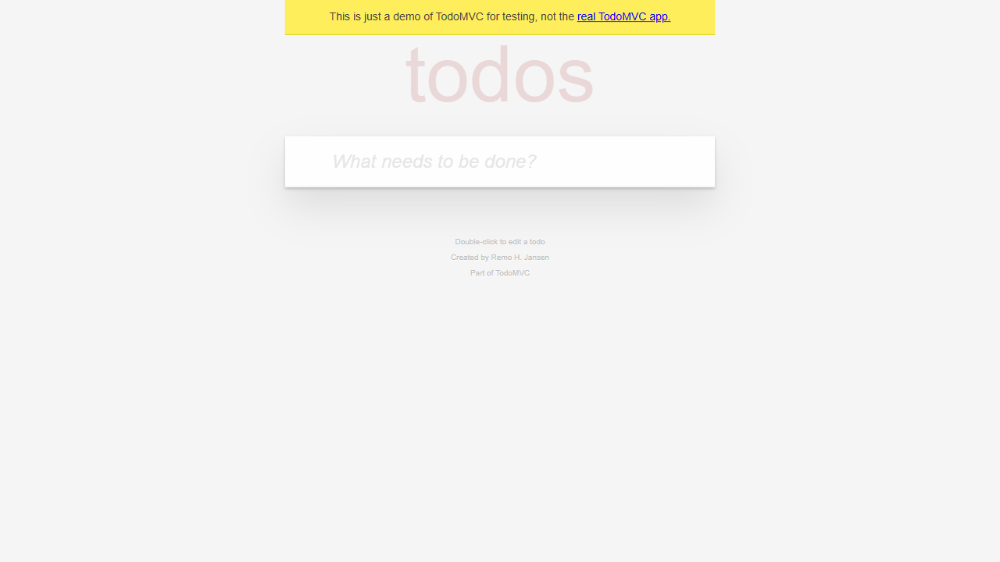
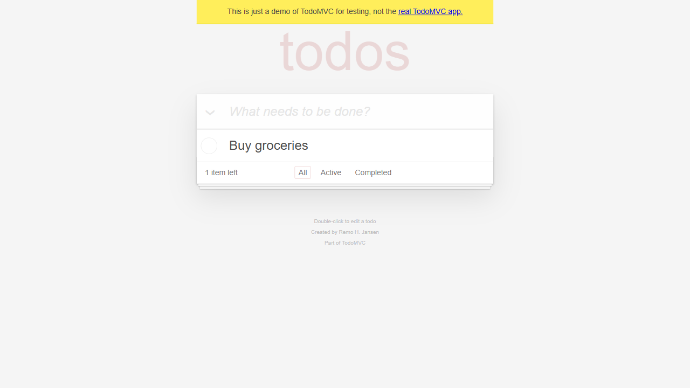
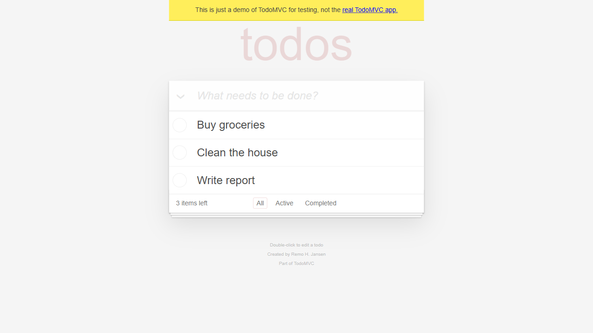
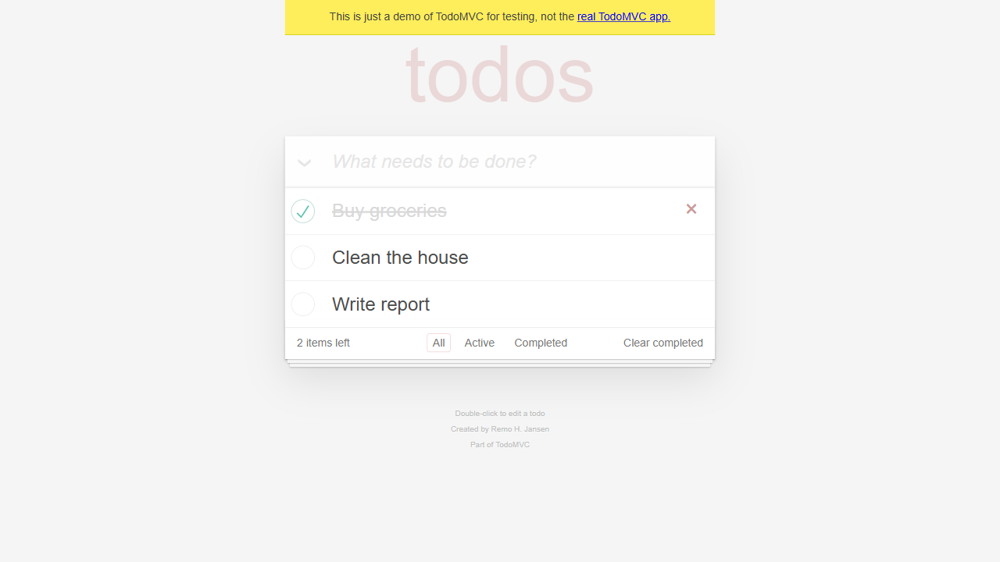
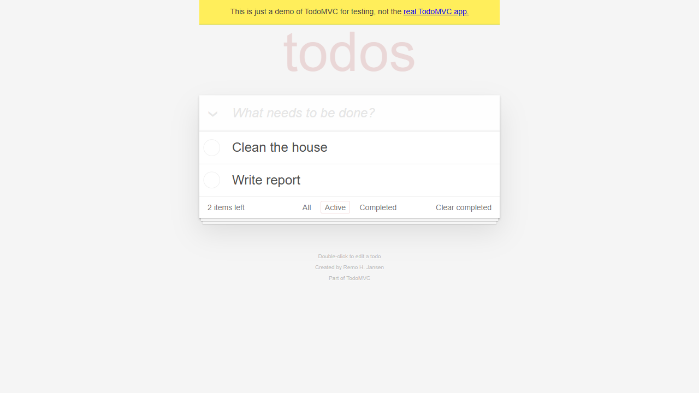
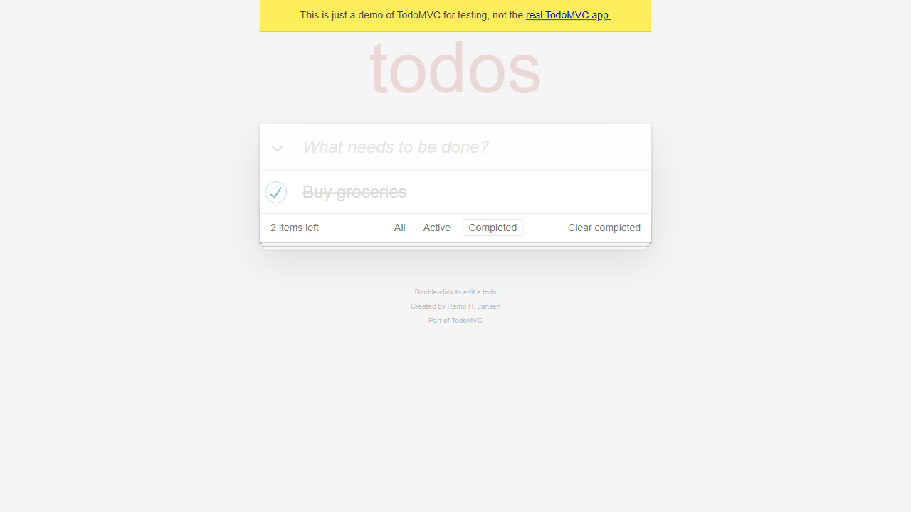
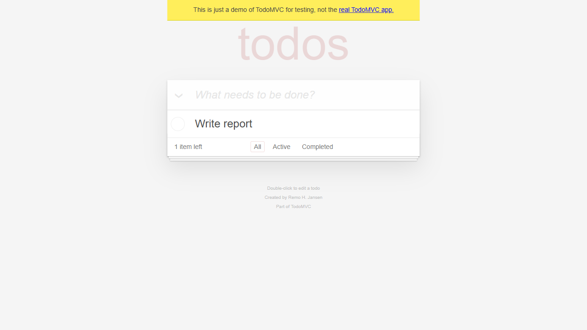

# E2E Test Report: TodoMVC Sample Scenario

**Date**: 2026-03-03 23:17
**Duration**: ~5 minutes
**Target**: https://demo.playwright.dev/todomvc/#/
**Browser**: Chromium (Playwright)
**Viewport**: 1280x720
**OS**: Windows 11 (win32)
**Scenario file**: `test-scenarios/todomvc-sample.csv`
**Preconditions**: localStorage cleared
**Result**: PARTIAL

## Summary

- Total steps: 21
- Passed: 18
- Failed: 1
- Skipped: 1 (unmapped action)
- Retried: 0
- Gap detected: 1 (step 21 — unknown action `wiggle`)

## Test Steps

### Step 1: Navigate to TodoMVC
- **Action**: navigate
- **Target**: https://demo.playwright.dev/todomvc/#/
- **Expected**: Page loads with heading "todos" and input field
- **Actual**: Page loaded. Heading "todos" and textbox "What needs to be done?" present
- **Status**: PASS
- **Screenshot**: 

---

### Step 2: Verify todos heading
- **Action**: verify
- **Target**: todos heading
- **Expected**: Heading text "todos" is displayed
- **Actual**: `heading "todos" [level=1]` found in accessibility tree
- **Status**: PASS

---

### Step 3: Add "Buy groceries"
- **Action**: type (submit:true)
- **Target**: New todo input field (ref=e8)
- **Input**: Buy groceries
- **Expected**: Text appears in input, item added to list
- **Actual**: "Buy groceries" added to list, "1 item left" displayed
- **Status**: PASS
- **Screenshot**: 

---

### Step 4: Verify todo list
- **Action**: verify
- **Target**: todo list
- **Expected**: Todo "Buy groceries" appears; count shows "1 item left"
- **Actual**: "Buy groceries" in list, counter shows "1 item left"
- **Status**: PASS

---

### Step 5: Add "Clean the house"
- **Action**: type (submit:true)
- **Target**: New todo input field (ref=e8)
- **Input**: Clean the house
- **Expected**: "Clean the house" in list; count "2 items left"
- **Actual**: Item added, counter shows "2 items left"
- **Status**: PASS

---

### Step 6: Add "Write report"
- **Action**: type (submit:true)
- **Target**: New todo input field (ref=e8)
- **Input**: Write report
- **Expected**: 3 items visible; count "3 items left"
- **Actual**: All 3 items visible, counter shows "3 items left"
- **Status**: PASS

---

### Step 7: Screenshot all todos
- **Action**: screenshot (fullPage)
- **Expected**: Full page screenshot of all three todos
- **Actual**: Screenshot captured with all 3 items visible
- **Status**: PASS
- **Screenshot**: 

---

### Step 8: Toggle "Buy groceries" complete
- **Action**: click
- **Target**: Toggle checkbox for Buy groceries (ref=e21)
- **Expected**: "Buy groceries" strikethrough; count "2 items left"
- **Actual**: Checkbox checked, counter shows "2 items left", "Clear completed" button appeared
- **Status**: PASS
- **Screenshot**: 

---

### Step 9: Verify items left counter
- **Action**: verify
- **Target**: Items left counter
- **Expected**: "2 items left" text displayed
- **Actual**: Counter shows "2 items left"
- **Status**: PASS

---

### Step 10: Click Active filter
- **Action**: click
- **Target**: Active filter link (ref=e30)
- **Expected**: Only "Clean the house" and "Write report" visible
- **Actual**: Only 2 active items shown, "Buy groceries" hidden
- **Status**: PASS
- **Screenshot**: 

---

### Step 11: Verify active filter
- **Action**: verify
- **Target**: todo list
- **Expected**: Completed "Buy groceries" NOT visible
- **Actual**: Only "Clean the house" and "Write report" in list
- **Status**: PASS

---

### Step 12: Click Completed filter
- **Action**: click
- **Target**: Completed filter link (ref=e32)
- **Expected**: Only "Buy groceries" visible
- **Actual**: Only "Buy groceries" (checked) shown
- **Status**: PASS
- **Screenshot**: 

---

### Step 13: Click All filter
- **Action**: click
- **Target**: All filter link (ref=e28)
- **Expected**: All 3 items visible again
- **Actual**: All 3 items visible (Buy groceries checked, others unchecked)
- **Status**: PASS

---

### Step 14: Toggle "Clean the house" complete
- **Action**: click
- **Target**: Toggle checkbox for Clean the house (ref=e49)
- **Expected**: "Clean the house" strikethrough; count "1 item left"
- **Actual**: Checkbox checked, counter shows "1 item left"
- **Status**: PASS

---

### Step 15: Clear completed
- **Action**: click
- **Target**: Clear completed button (ref=e42)
- **Expected**: Completed items removed; only "Write report" remains
- **Actual**: "Buy groceries" and "Clean the house" removed, only "Write report" in list
- **Status**: PASS
- **Screenshot**: 

---

### Step 16: Hover to reveal destroy button
- **Action**: hover
- **Target**: Write report todo item (ref=e55)
- **Expected**: Destroy button (X) becomes visible
- **Actual**: `button "Delete"` appeared in accessibility tree
- **Status**: PASS

---

### Step 17: Click destroy button
- **Action**: click
- **Target**: Destroy button on Write report item (ref=e56)
- **Expected**: List empty; footer disappears
- **Actual**: All list items removed, footer gone, only heading + input remain
- **Status**: PASS
- **Screenshot**: 

---

### Step 18: Verify empty state
- **Action**: verify
- **Target**: page
- **Expected**: Empty state with just the input field
- **Actual**: Only heading "todos" and textbox "What needs to be done?" in tree
- **Status**: PASS

---

### Step 19: Empty input edge case
- **Action**: type (submit:true)
- **Target**: New todo input field (ref=e8)
- **Input**: (empty)
- **Expected**: Press Enter with empty input; no item should be created
- **Actual**: No item created, page state unchanged
- **Status**: PASS

---

### Step 20: Double-click deleted item
- **Action**: dblclick
- **Target**: Buy groceries todo item
- **Expected**: Edit mode activates for the item
- **Actual**: Target "Buy groceries todo item" not found in accessibility tree — item was deleted in earlier steps
- **Status**: FAIL
- **Page URL**: https://demo.playwright.dev/todomvc/#/
- **Console Errors**: Failed to load resource: 404 (favicon.ico — benign)
- **Screenshot**: 

---

### Step 21: Unknown action "wiggle"
- **Action**: wiggle
- **Target**: some element
- **Expected**: Element wiggles around
- **Actual**: Action `wiggle` is not in the action-to-tool mapping. Flagged as infrastructure issue
- **Status**: SKIPPED (unmapped action)

---

## Failed Steps Detail

### Step 20: Double-click deleted item
- **Error**: Target element "Buy groceries todo item" does not exist on the page. The item was deleted in steps 14-15 (cleared as completed). This is an expected failure by test design — validates failure handling
- **Page URL**: https://demo.playwright.dev/todomvc/#/
- **Console Errors**: Only benign favicon 404
- **Screenshot**: 

## Gap Detection

### Flagged Issues
1. **Step 21 — Unknown action `wiggle`**: Not in the action-to-tool mapping. Recommend removing or replacing with a valid action
2. **Step 20 — Intentional failure**: Tests dblclick on a previously deleted element. Valid for testing failure handling but would always fail in this sequence

### Coverage Gaps Noted
- No special characters / XSS input testing
- No very long text input (500+ chars)
- No rapid duplicate input testing
- No toggle-back (unmark completed) testing
- No keyboard-only navigation (Tab, Enter, Escape)

## Recommendations

1. Remove step 21 (`wiggle`) — it tests gap detection but should not be in a production scenario
2. Move step 20 (dblclick) earlier in the scenario (before the item is deleted) to test actual edit functionality
3. Consider adding edge cases from the coverage gaps list above
4. The TodoMVC demo has good accessibility markup — all elements were findable via the accessibility tree
