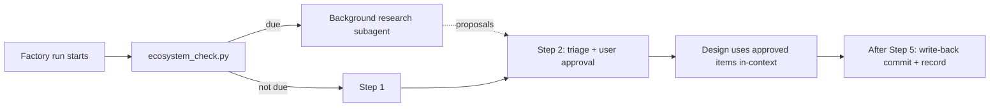

# Ecosystem Refresh Protocol

**WHEN TO READ**: only when `scripts/ecosystem_check.py` prints `"due": true`, or the
user explicitly asks for a refresh. Never during a not-due run — this file costs
tokens that a normal run does not need.

## Why this loop exists

OIAE (`skill-improvement-guide.md`) learns from the *inside*: a user hits a problem,
rates the run, and the log accumulates until a pattern crosses the 3-entry threshold.
Nothing in that loop notices that the *ecosystem* moved — a new model family, a new
`claude plugin` subcommand, a changed skill-spec field, a Codex skills-format change.
A best practice nobody has heard of never produces a feedback entry.

This loop is the exogenous half: it reads primary sources when Claude Code or Codex
has moved, and proposes updates to the factory's knowledge base
(`references/ecosystem-practices.md`). The factory then designs every new skill
against current practices instead of against whatever was true when it was written.



## 1. Launch the research (background)

- Spawn one `general-purpose` subagent (it needs WebFetch and Bash) with
  **run in background** set, using the brief in section 2. Do not wait for it —
  continue with Step 1 of the factory workflow.
- Fill the brief's placeholders from the `ecosystem_check.py` JSON output
  (`recorded`, `current`, `last_refresh`) and from
  `ecosystem-state.json`'s `declined` list.
- Where no background subagent is available (e.g. the factory running under Codex),
  skip the refresh and do **not** run `record` — the next Claude Code run picks it up.

## 2. Research brief (paste into the subagent prompt, placeholders filled)

> You are refreshing the knowledge base of `my-skill-factory`, a skill that creates
> Claude Code / Codex skills. Find what changed in the ecosystem that should change
> **how a skill is designed, written, or verified** — and nothing else.
>
> Context: recorded at last refresh → `<recorded>` (on `<last_refresh>`); installed now
> → `<current>`. Previously declined proposals (do not re-propose unless the source
> changed materially): `<declined titles>`.
>
> Read first: `<repo-root>/my-skill-factory/references/ecosystem-practices.md` (the
> current knowledge base) and `<repo-root>/my-skill-factory/SKILL.md` (the workflow
> it feeds). Report only deltas against these.
>
> **Sources — primary only, this fixed list.** Local CLI help outranks web docs,
> because it describes what is actually installed here.
>
> | Area | Source | Read cheaply |
> |------|--------|--------------|
> | Installed CLI surface | `claude --help`, `claude plugin --help`, `codex --help` | full |
> | Claude Code releases | `https://raw.githubusercontent.com/anthropics/claude-code/main/CHANGELOG.md` | slice `## <version>` sections with `curl -sL … \| awk`; only versions newer than recorded (first run: the newest 15 sections). Each section is ~100 lines — never read the whole file. |
> | Claude Code features | `https://code.claude.com/docs/en/skills`, `…/sub-agents`, `…/plugins` | WebFetch with a focused prompt |
> | Skill authoring | `https://platform.claude.com/docs/en/agents-and-tools/agent-skills/best-practices`, `https://agentskills.io/specification` | WebFetch |
> | Models | `https://platform.claude.com/docs/en/about-claude/models/overview` | WebFetch |
> | Codex releases | `gh api 'repos/openai/codex/releases?per_page=30'` — tags are `rust-vX.Y.Z`; skip `-alpha` tags; only versions newer than recorded (first run: newest 5 stable) | `--jq` to name + body |
> | Codex skills / agents | `https://developers.openai.com/codex/skills`, `https://agents.md` | WebFetch |
>
> **Areas** (tag each proposal with one): `models` (current IDs, deprecations,
> model-specific prompting / effort guidance), `tokens` (loading cost, progressive
> disclosure, ways to measure cost), `agents` (subagents, background agents, agent
> definitions), `authoring` (frontmatter / spec fields, plugin manifest rules,
> evals and testing), `codex` (Codex skills format, AGENTS.md, differences from
> Claude Code).
>
> **Rules**
> 1. Every claim must come from a source you fetched or ran *in this session*. Never
>    from memory. If a doc and `--help` disagree, trust `--help` and say so.
> 2. Report only changes to how skills are designed / written / verified. Skip bug
>    fixes, UI tweaks, and features irrelevant to skill building.
> 3. Re-verify any knowledge-base item whose `verified` date is older than 90 days;
>    propose `retire` for items you can no longer confirm.
> 4. Do not edit, create, or delete any file. Return proposals only.
> 5. At most 12 proposals, ranked by impact on skill quality. Keep the whole reply
>    under ~1500 words — no page dumps, no raw changelog excerpts.
>
> **Return exactly this format**
>
> ```
> ### P<n>: <one-line title>
> - kind: add | update | retire
> - area: models | tokens | agents | authoring | codex
> - target: ecosystem-practices.md § <section>   (or: SKILL.md § <section> — workflow change)
> - claim: <1-2 sentences: what is true now>
> - applies: <scope, e.g. "Claude Code >= 2.1.280", "Codex >= 0.158", "Claude 5 family">
> - source: <URL or CLI command> (verified <YYYY-MM-DD>)
> - factory impact: <what the factory should now do differently>
> - proposed text: <the exact knowledge-base line, in its item format>
> ```
>
> End with: `Checked, nothing new: <areas>` and `Upgrade available: <tool> <installed> → <latest stable>` for any CLI behind its latest release.

## 3. Triage (start of Step 2, or at the end if the research is still running)

- Present every proposal to the user with `AskUserQuestion` (multiSelect, up to 4
  proposals per question; chunk larger sets). **Always ask, even in auto-mode** — the
  same rule as model upgrades: never silently change what the factory believes.
- Show each option as title + `claim` + `source`, so the user can judge it without
  opening the link.
- Approved items are **used immediately, in-context**, by this run's Step 2 design.
  They are not written to disk yet.
- If the research is still running when Step 2 starts, design with the current
  knowledge base and triage at the end instead of blocking the user.

## 4. Write-back (after Step 5 of the primary task — a separate commit)

Never interleave this with the skill being created: the primary task's commit goes
first, then this one.

1. Apply approved items to `<repo-root>/my-skill-factory/references/ecosystem-practices.md`
   (`add` / `update` / `retire`); apply approved `SKILL.md`-targeted items to the
   factory's `SKILL.md`. Keep the knowledge base under its size cap — retire before
   adding when it is full.
2. Add declined proposal titles, with today's date, to `declined` in
   `<repo-root>/my-skill-factory/feedback/ecosystem-state.json`. Drop `declined`
   entries older than 180 days.
3. Stamp the refresh — always, even if every proposal was declined (the research
   happened; re-running it tomorrow would find the same things):
   ```bash
   cd <repo-root>
   python my-skill-factory/scripts/ecosystem_check.py record
   ```
4. If anything was applied: bump the factory `version` (patch for knowledge-base-only
   changes, minor for a `SKILL.md` workflow change), and append an `AMD-NNN` entry to
   `feedback/amendments.md` with `Source: ecosystem-refresh` and the proposals'
   source URLs as `Evidence`.
5. Path-discipline grep, then install **with an explicit version** — the script
   defaults to 1.0.0 and would silently leave a stale higher-version cache in charge:
   ```bash
   cd <repo-root>
   python my-skill-factory/scripts/install_skill.py my-skill-factory --version <new-version>
   ```
6. Smoke: `claude -p` listing shows `my-skill-factory:my-skill-factory`, and the
   installed cache dir carries the new version.
7. Commit and push:
   `chore(my-skill-factory): ecosystem refresh <YYYY-MM-DD> (AMD-NNN)`.
   A declined-only refresh still commits the updated `ecosystem-state.json`.
