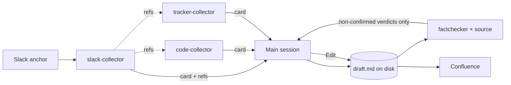

# Postmortem

Turn a Slack incident thread into a fact-checked, blameless postmortem published to Confluence.

## Core constraint: the main session stays thin

Incident evidence is bulky and low-signal: Slack history, diffs, issue bodies, logs. Pulled into
the main session it crowds out the reasoning that actually matters. Two rules keep it out:

**1. Fetching is delegated.** The main session runs Bash for exactly three things — the Phase 0
preflight, the Phase 7 ticket creation, and the Phase 8 publish. **Any command that fetches incident
evidence is delegated to a subagent, whatever the tool.** Not a blacklist of commands: a rule about
purpose. If you are about to run something to find out what happened, you are doing a collector's
job — dispatch the collector instead.

**2. The document lives on disk.** From Phase 4 on, the draft is a file. It is written once with
Write, revised with Edit (the changed section only, never the whole document), and published with
`confluence create -f <file>`. It is never re-emitted into the conversation — not to show the user,
not to revise, not to publish. A 120-line document re-pasted through three review rounds and a
heredoc costs five copies of itself; a file on disk costs one.

A subagent's return lands in this context verbatim — there is no filter you can apply after the
fact. So the caps live **in the collector's own prompt**, where they can still be honoured, and each
collector self-checks before returning. If a card arrives over cap anyway, the damage is already
done: do not quote it, re-read it, or paste it. Use what is usable, and note it in the Retrospective.



## Constraints

- **Blameless.** Describe systems, processes, and decisions — never a person's judgement. Name people
  only as actors ("on-call ack'd"), never as causes. **No counterfactuals**: "if only X had noticed",
  "should have caught", "failed to check" are blame in the grammar of hindsight. If a sentence
  implies a person should have behaved differently, the finding belongs to the system that let the
  behaviour matter.
- Every timeline row and every quantitative claim carries a source link. No source → it is an open
  question or a labelled assumption, not a fact.
- Never publish, and never create a Jira ticket, without explicit user approval.
- Document body is **English**. Commit messages are English (repo convention).
- Raw Slack IDs (`<@UXXX>`, `<#CXXX>`) must never reach the draft — collectors resolve them.

## Phase 0: Preflight

Check each tool independently. **Do not chain with `&&`** — one missing tool would short-circuit the
rest and mis-report present tools as absent.

**Presence is not readiness.** A CLI can be installed and unauthenticated, which fails later, deep
inside a collector, and looks like "the incident left no trace in GitHub" rather than "I was never
logged in". Check that it can actually talk to its service:

```bash
for t in slack-cli jira confluence gh; do
  printf "%-12s " "$t"
  command -v "$t" >/dev/null 2>&1 || { echo "MISSING"; continue; }
  case "$t" in
    gh)         gh auth status  >/dev/null 2>&1 && echo OK || echo "INSTALLED, NOT AUTHENTICATED" ;;
    confluence) confluence spaces >/dev/null 2>&1 && echo OK || echo "INSTALLED, AUTH FAILED" ;;
    slack-cli)  slack-cli channels --format json >/dev/null 2>&1 && echo OK || echo "INSTALLED, AUTH FAILED" ;;
    jira)       jira project list >/dev/null 2>&1 && echo OK || echo "INSTALLED, AUTH FAILED" ;;
  esac
done
```

`slack-cli` is required — it is the anchor source. Missing or unauthenticated → stop:
`npm install -g @urugus/slack-cli`, then `slack-cli config set`.

`gh`, `jira`, `confluence` are optional. Missing **or unauthenticated** → warn, skip the matching
collector, and record the missing evidence source under **Open questions**. Treat an unauthenticated
tool exactly like an absent one; do not dispatch a collector that cannot read its source. Missing
`confluence` means the document is written to disk and not published — which is not a failure, just
an unpublished postmortem.

### Feedback Check

If `feedback/log.md` exists next to this SKILL.md and has 5+ entries, read the last 10 (`tail`, not
the whole file). If a pattern is apparent (same issue in 3+ entries, or average rating below 3),
tell the user: "Recurring feedback detected: [brief pattern]. Consider `/skill-improve --skill postmortem`."
Continue either way.

## Phase 1: Resolve the anchor

The anchor is a Slack incident thread. Accept:

- **Permalink** — `https://<team>.slack.com/archives/C0123ABCDEF/p1711234567890123`
  → channel `C0123ABCDEF`, thread_ts `1711234567.890123` (strip `p`, insert `.` before the last 6 digits)
- **Channel name** (`#incident-2026-07-10`) — the collector finds the thread; if several match, it
  reports them and you ask the user to pick
- **Search query** — the collector searches and reports candidate threads

Parse the URL here (string work, no fetching). Do not fetch the thread.

## Phase 2: Collect evidence (fan-out)

Two stages, because the GitHub and Jira targets are *discovered inside* the Slack thread.

**Stage A — Slack.** Dispatch one subagent via the Agent tool, `subagent_type`
`postmortem:slack-collector`, passing only the anchor and (if the user gave one) the incident window.
It returns a **Slack evidence card**: timestamped events with permalinks, resolved participant names,
up to 5 short quotes, the signal timestamps, how the incident was detected, discovered `refs` (Jira
keys, PR/commit URLs, dashboards), and explicit gaps.

**Stage B — Code and tracker.** Using Stage A's `refs`, dispatch **in parallel** (multiple Agent
calls in one message):

- `postmortem:code-collector` — deploys, merges, the candidate trigger, any revert. Seed with the
  PR/commit refs, the repo, and the window.
- `postmortem:tracker-collector` — the incident ticket, status transitions, and **prior incidents
  with the same failure mode**. Seed with the Jira keys.

Skip a collector whose CLI is missing or whose refs are empty, and record it as an open question. If
the Slack card reports no code refs but the user knows the repo, ask once and seed `code-collector`
with the window instead of refs.

WHEN TO READ `references/evidence-card-schema.md`: before merging cards in Phase 3, or when a card
comes back malformed and you need to state the contract back to the collector.

## Phase 3: Merge, measure, interrogate

Merge the cards into one chronological timeline. Every row: `time (with TZ) | event | source link`.
Reconcile conflicting timestamps by preferring the source closest to the event (a deploy's commit
time beats someone's Slack recollection of it); note the discrepancy.

**Cap the timeline at 40 rows.** Three collectors can each return 40 events. If the merge exceeds 40,
keep the rows that change state — impact starts, detection, each hypothesis acted on, each
intervention, mitigation, all-clear — collapse consecutive status chatter into one row ("14:10–14:35
investigation, no state change"), and say so under Open questions. A 120-row timeline is not more
truthful; it is unreadable, and it is three copies of your context budget.

### Metrics

| Metric | Definition | What it measures |
|--------|-----------|------------------|
| **TTD** — time to detect | `detected_at − first_impact_at` | how long users hurt before anyone knew |
| **TTM** — time to mitigate | `mitigated_at − first_impact_at` | **the headline number.** How long users actually hurt |
| **TTR** — time to resolve | `resolved_at − first_impact_at` | includes post-impact cleanup and the admin close |

TTM is the number that describes customer pain; TTR bundles in work that happened after users
recovered. Report both, lead with TTM, and never present TTR as the recovery time.

**If `first_impact_at` is unknown** — and it often is, because impact usually precedes the first
message — do not silently substitute `detected_at`; that would report TTD as zero and flatter the
monitoring. Ask the user. If they cannot say either, record TTD/TTM/TTR as "unknown — first impact
never established", report `mitigated_at − detected_at` instead, and label it **time to mitigate from
detection**. Then make "we cannot tell when impact began" an open question — it is a monitoring gap,
and usually an action item.

### Interrogate

Use **AskUserQuestion** (one round) for what the sources genuinely cannot answer. Ask what is
missing, not a fixed list — but the questions the sources almost never answer, and which most change
the document, are: **how big was the impact** (customers, transactions, revenue), **when did impact
actually begin**, and **which of several candidate changes was the real trigger**. Never ask what a
collector already answered.

## Phase 4: Draft to disk

WHEN TO READ `references/postmortem-template.md`: now. It holds the section template, the severity
rubric, the trigger/root-cause/contributing-factors distinction, and the action-item taxonomy.

Write the draft **to a file** with the Write tool: `postmortem-<YYYY-MM-DD>-<slug>.md` in the working
directory. From here on the document is that file. Show the user a section at a time when they ask;
never re-emit the whole thing.

Write a second file, `postmortem-<YYYY-MM-DD>-<slug>.claims.md`, listing every **factual** claim:

```
| id | claim | source | section |
|----|-------|--------|---------|
| C1 | Alert fired 2026-07-10 14:03 JST | <permalink> | Timeline |
| C7 | PR #456 merged 13:52 JST, 9 min before first impact | <pr url> | Root Cause |
| C9 | TTM = 40 min | derived: mitigated 14:41 − first impact 14:01 (both <permalink>) | Overview |
```

**Cap the claim list at 30**, prioritising: signal timestamps → TTD/TTM/TTR → impact figures → the
trigger → timeline rows that carry a number or an attribution. A timeline row that merely says
"investigation continued" does not need verification.

**Only factual claims go in.** The root cause, the contributing factors, and the lessons are
*interpretation* — a source can never confirm them, so a fact-checker can only return UNSUPPORTED and
hedge them into mush. They are verified by the user in Phase 6, not by a subagent. Fact-check what a
source can settle: times, numbers, what changed, who acted, what someone said.

## Phase 5: Fact-check (fan-out)

WHEN TO READ `references/factcheck-protocol.md`: now.

Group the claims by source domain (slack / code / tracker) and dispatch one `postmortem:factchecker`
per non-empty domain **in parallel**, passing the **path to the claims file** and the domain to
verify. The fact-checkers re-fetch from the original sources in their own contexts — they are
deliberately not given the evidence cards, which is what makes this verification rather than
proofreading.

They return **only the claims that are not CONFIRMED**, plus a count. A verdict table with 25
"CONFIRMED — no correction" rows is 25 rows of nothing.

Apply the verdicts by **Edit** on the draft file:

- **CONTRADICTED** → correct or delete. Never publish it. If a signal timestamp changed, recompute
  TTD/TTM/TTR and walk every claim derived from it — corrections cascade.
- **UNSUPPORTED** → attribute it ("the on-call's recollection was…"), hedge it, or drop it. An
  unmarked UNSUPPORTED claim reads as established fact.

If more than a third of the claims come back CONTRADICTED, stop patching — the Phase 3 merge was
built on a bad reading (usually a timezone applied to the whole timeline, or the wrong thread). Tell
the user, re-run Stage A, and rebuild.

## Phase 6: User review

Tell the user the file path and the fact-check summary
(`24 claims: 20 confirmed, 3 corrected, 1 unconfirmed — the customer count`). Point them at the
sections that need a human: the root cause, the contributing factors, and anything still unconfirmed.

Revise with **Edit on the file**, one section at a time. The user may approve, revise, or cancel
(clean exit — nothing published, nothing filed).

## Phase 7: Action items

Present the action-item table for approval — this table is short enough to show inline.

Offer, do not assume, to file each approved item as a Jira ticket:

```bash
jira issue create --project <KEY> --type Task \
  --summary "<action>" --description-file <path> --priority <P>
```

Leave every ticket **unassigned** (omit `--assignee`). Note: the installed `@pchuri/jira-cli` has no
`--label` flag on `issue create` — labels cannot be set from the CLI, so do not promise them; if the
project requires labels, tell the user to add them in Jira, or use the Atlassian MCP tools.

Write the returned issue keys back into the draft's Action Items table (Edit) so the published
document links real tickets.

## Phase 8: Publish

WHEN TO READ `references/publish-confluence.md`: now. It has the exact `confluence create` /
`create-child` invocations, the title convention, and space-key resolution.

Publish from the file (`-f`), never from a heredoc. Then:

1. Comment the page URL onto the incident Jira ticket, if one exists.
2. Offer — always ask — to post the page link back to the Slack thread.
3. If publishing fails, **do not lose the document**: it is already on disk. Report the path and the
   error; the publish step is cheap to retry, the document was not.

Report: Confluence URL, Jira keys created, source thread permalink, local file path.

## Deferred (TODO)

- [ ] **Observability collector** (Datadog / CloudWatch / Grafana). The reference article pulls error
      rates and impact metrics from Datadog; no such CLI is configured here, so quantitative impact
      comes from the user in Phase 3. Adding it means one more `agents/` collector emitting the same
      evidence-card shape — nothing else changes.
- [ ] **Notion publishing target.** `notion-cli` exists in this repo; Confluence was chosen as the
      single v1 target. A second publisher would be a Phase 8 branch.
- [ ] **Action-item labels.** Blocked on the installed jira CLI having no `--label` flag on
      `issue create`. Would need the Atlassian MCP path.

## Behavior scenarios

BDD spec lives in `references/scenarios.feature`. Read only when auditing or amending this skill;
not needed for normal execution.

## Retrospective

After Phase 8 (or a clean cancel), reflect on the run:

1. Consider: mid-run corrections, a collector returning an over-cap dump, a high CONTRADICTED rate,
   collectors that found nothing, or questions the user had to answer that a source should have.
2. Ask the user (in Japanese): 「今回のポストモーテム生成のフィードバック (1-5の評価、気になった点、または何もなければEnter)」
   If the rating is < 5, always follow up: 「なぜその評価ですか？ (改善のために具体的に教えてください)」
3. If the user gives feedback OR issues actually occurred, create `feedback/` next to this SKILL.md
   if missing, read `feedback/log.md` (create with a `# Feedback Log` header if absent), and prepend
   an entry after the header with: ISO-8601 timestamp, skill version, task, outcome, rating, rating
   reason, corrections, issues, user note.
4. If the user skips and nothing went wrong, end without recording.

## References

- `references/evidence-card-schema.md` — the return contract every collector must satisfy (fields, caps, citation rules). Read before merging cards, or when a card comes back malformed.
- `references/postmortem-template.md` — document template, severity rubric, root-cause guidance, action-item taxonomy. Read in Phase 4.
- `references/factcheck-protocol.md` — claim grouping, verifier dispatch, verdict schema, correction cascade. Read in Phase 5.
- `references/publish-confluence.md` — publish commands, title convention, space-key resolution, failure handling. Read in Phase 8.
- `references/scenarios.feature` — BDD spec. Read only when auditing or amending the skill.
